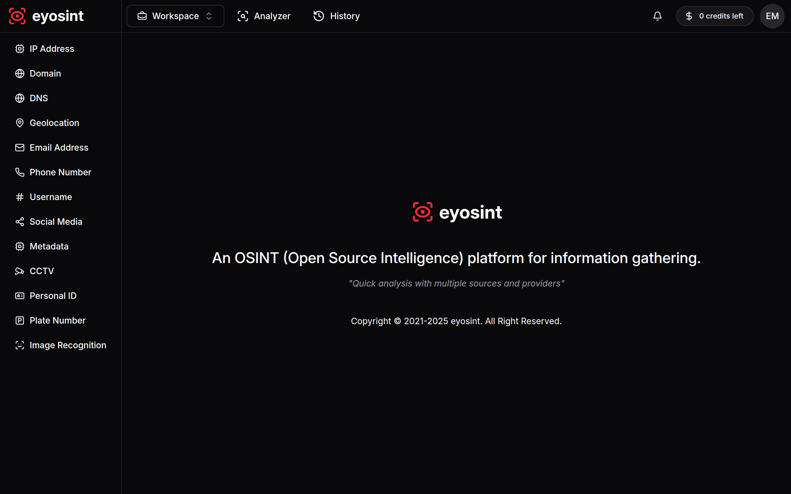

# eyosint

An OSINT (Open Source Intelligence) platform for information gathering.
<i>"Quick analysis with multiple sources and providers"</i>

## Features

- Workspaces
- Subscriptions
- API

## List Tools

- Whois Lookup (IP, Domain, DNS, Geolocation, etc.)
- Personal Identity (Phone, Email, ID, Plate License, etc.)
- Network (Cellular Tower, Public CCTV, WiFi, etc.)
- Metadata
- Image Recognition

## Disclaimers

> [!IMPORTANT]
> All data sources is public available and subscription resources. Zero hacking or illegal activity.

## Licenses

Copyright 2021-2025 Garuda Project

Licensed under the Apache License, Version 2.0 (the "License");
